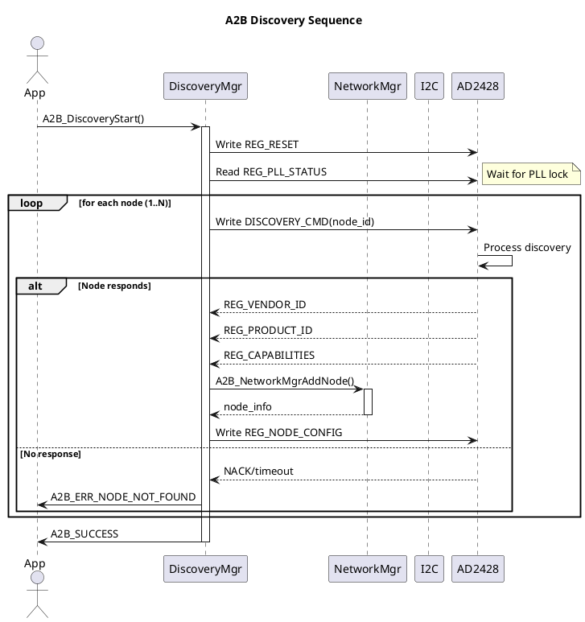
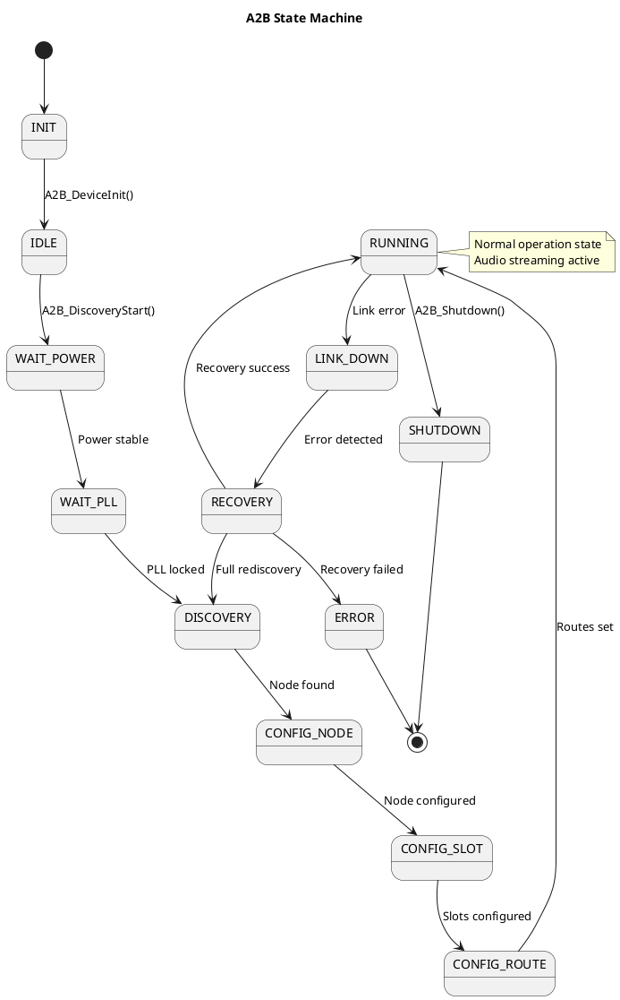

# OpenA2B Phase 4: Polish Implementation Plan

> **For agentic workers:** REQUIRED SUB-SKILL: Use superpowers:subagent-driven-development (recommended) or superpowers:executing-plans to implement this plan task-by-task. Steps use checkbox (`- [ ]`) syntax for tracking.

**Goal:** Polish the OpenA2B project with Doxygen documentation, PlantUML architecture diagrams, GitHub README, LICENSE, and CHANGELOG for release readiness.

**Architecture:** Phase 4 is documentation-only - no code changes. All documentation is generated from existing source code and the design spec. Files follow Linux Kernel style with MIT license.

**Tech Stack:** Doxygen, PlantUML, Markdown, CMake

---

## File Structure

```
OpenA2B/
├── LICENSE                        # NEW: MIT License
├── README.md                      # NEW: Project overview
├── CHANGELOG.md                   # NEW: Version history
├── docs/
│   ├── Doxyfile.in               # NEW: Doxygen configuration
│   ├── api_reference.md           # NEW: API documentation
│   ├── architecture.md            # NEW: System architecture
│   └── plantuml/                  # NEW: Architecture diagrams
│       ├── discovery_sequence.puml
│       ├── state_machine.puml
│       └── routing_diagram.puml
└── (existing files unchanged)
```

---

## Task 1: Add MIT LICENSE

**Files:**
- Create: `LICENSE`

- [ ] **Step 1: Create LICENSE**

```markdown
MIT License

Copyright (c) 2026 OpenA2B Contributors

Permission is hereby granted, free of charge, to any person obtaining a copy
of this software and associated documentation files (the "Software"), to deal
in the Software without restriction, including without limitation the rights
to use, copy, modify, merge, publish, distribute, sublicense, and/or sell
copies of the Software, and to permit persons to whom the Software is
furnished to do so, subject to the following conditions:

The above copyright notice and this permission notice shall be included in all
copies or substantial portions of the Software.

THE SOFTWARE IS PROVIDED "AS IS", WITHOUT WARRANTY OF ANY KIND, EXPRESS OR
IMPLIED, INCLUDING BUT NOT LIMITED TO THE WARRANTIES OF MERCHANTABILITY,
FITNESS FOR A PARTICULAR PURPOSE AND NONINFRINGEMENT. IN NO EVENT SHALL THE
AUTHORS OR COPYRIGHT HOLDERS BE LIABLE FOR ANY CLAIM, DAMAGES OR OTHER
LIABILITY, WHETHER IN AN ACTION OF CONTRACT, TORT OR OTHERWISE, ARISING FROM,
OUT OF OR IN CONNECTION WITH THE SOFTWARE OR THE USE OR OTHER DEALINGS IN THE
SOFTWARE.
```

- [ ] **Step 2: Commit**

```bash
git add LICENSE
git commit -m "docs: Add MIT LICENSE

Co-Authored-By: Claude <noreply@anthropic.com>"
```

---

## Task 2: Create GitHub README

**Files:**
- Create: `README.md`

- [ ] **Step 1: Create README.md**

```markdown
# OpenA2B - Open Automotive Audio Bus Driver Framework

[](https://github.com/open-a2b/open-a2b/actions)
[](LICENSE)

OpenA2B is a platform-independent, RTOS-independent, MCU-independent A2B (Automotive Audio Bus) master stack designed for automotive audio applications.

## Features

- **Platform Independent**: Runs on STM32, S32K, TC397, Linux, and more
- **RTOS Independent**: No dependency on specific RTOS APIs
- **Clean Architecture**: Device-centric, ops-based design (Linux Kernel style)
- **Mock Hardware**: Full CI testing without target hardware
- **Comprehensive Tests**: 103+ unit tests with Unity framework

## Quick Start

### Prerequisites

- CMake 3.15+
- C11 compatible compiler
- (Optional) Doxygen for documentation

### Build

```bash
git clone https://github.com/open-a2b/open-a2b.git
cd open-a2b
mkdir build && cd build
cmake ..
make
```

### Run Tests

```bash
ctest -V
```

## Project Structure

```
OpenA2B/
├── include/          # Public headers (a2b_*.h)
├── core/             # Framework core (a2b_*.c)
├── hal/              # Hardware abstraction layer
├── mock/             # Mock AD2428 for testing
├── register/         # AD2428 register definitions
├── test/             # Unity unit tests
└── docs/             # Documentation
```

## Modules

| Module | Description |
|--------|-------------|
| `a2b_discovery` | Node discovery and enumeration |
| `a2b_network` | Network topology management |
| `a2b_audio` | Audio routing (upstream/downstream) |
| `a2b_slot` | TDM slot configuration |
| `a2b_clock` | PLL clock management |
| `a2b_irq` | Interrupt handling |
| `a2b_state` | State machine |
| `a2b_diagnostic` | Diagnostic event logging |
| `a2b_recovery` | Fault recovery strategies |
| `a2b_remote` | Remote register access |

## Documentation

- [API Reference](docs/api_reference.md)
- [Architecture](docs/architecture.md)
- [Design Specification](docs/superpowers/specs/2026-06-30-OpenA2B-design.md)

## License

MIT License - see [LICENSE](LICENSE)

## Contributing

Contributions welcome! Please see CONTRIBUTING.md for guidelines.
```

- [ ] **Step 2: Commit**

```bash
git add README.md
git commit -m "docs: Add GitHub README

- Project overview and features
- Quick start guide
- Module documentation
- CI badge and license

Co-Authored-By: Claude <noreply@anthropic.com>"
```

---

## Task 3: Create CHANGELOG

**Files:**
- Create: `CHANGELOG.md`

- [ ] **Step 1: Create CHANGELOG.md**

```markdown
# Changelog

All notable changes to this project will be documented in this file.

The format is based on [Keep a Changelog](https://keepachangelog.com/en/1.0.0/).

## [1.0.0] - 2026-06-30

### Added

- Phase 1: Foundation
  - CMake build system
  - Platform HAL (Linux I2C/Timer)
  - Mock I2C with error injection
  - AD2428 register definitions
  - Logger system with compile-time levels
  - Mock AD2428 hardware
  - Unity test framework
  - GitHub Actions CI

- Phase 2: Core Features
  - Device and network managers
  - Discovery manager with node enumeration
  - IRQ event callbacks
  - Remote register access
  - State machine with transition validation

- Phase 3: Advanced Features
  - Audio routing manager (upstream/downstream)
  - TDM slot configuration
  - PLL clock management
  - Diagnostic event logging (circular buffer)
  - Recovery manager (node reset, link renegotiate, full discovery)
```

- [ ] **Step 2: Commit**

```bash
git add CHANGELOG.md
git commit -m "docs: Add CHANGELOG

- Version history format
- Phase 1/2/3 feature summaries

Co-Authored-By: Claude <noreply@anthropic.com>"
```

---

## Task 4: Create Doxygen Configuration

**Files:**
- Create: `docs/Doxyfile.in`

- [ ] **Step 1: Create docs/Doxyfile.in**

```doxygen
# Doxyfile for OpenA2B

PROJECT_NAME           = "OpenA2B"
PROJECT_NUMBER         = 1.0.0
PROJECT_BRIEF          = "Open Automotive Audio Bus Driver Framework"
OUTPUT_DIRECTORY       = doxygen
CREATE_SUBDIRS         = NO

# C language
OPTIMIZE_OUTPUT_FOR_C  = YES
EXTENSION_MAPPING      = h=C

# Source browsing
SOURCE_BROWSER         = YES
INLINE_SOURCES         = NO

# HTML output
GENERATE_HTML          = YES
HTML_OUTPUT            = html
HTML_COLORSTYLE_HUE    = 200
HTML_COLORSTYLE_SAT    = 100
HTML_TIMESTAMP         = YES

# LaTeX (optional)
GENERATE_LATEX         = NO

# XML output (for future use)
GENERATE_XML           = YES
XML_OUTPUT             = xml

# Configuration file
GENERATE_TAGFILE       = docs/open-a2b.tag

# Include all headers
INPUT                  = include \
                         core \
                         hal \
                         register \
                         mock

# Exclude test files from docs
EXCLUDE                = test

# File patterns
FILE_PATTERNS          = *.h \
                         *.c

# Recursive scan
RECURSIVE              = YES

# Quiet mode
QUIET                  = YES

# Warnings
WARN_IF_UNDOCUMENTED   = YES
WARN_NO_PARAMDOC       = YES
```

- [ ] **Step 2: Commit**

```bash
git add docs/Doxyfile.in
git commit -m "docs: Add Doxygen configuration

- C language optimizations
- HTML and XML output
- Source browsing enabled

Co-Authored-By: Claude <noreply@anthropic.com>"
```

---

## Task 5: Create API Reference Documentation

**Files:**
- Create: `docs/api_reference.md`

- [ ] **Step 1: Create docs/api_reference.md**

```markdown
# OpenA2B API Reference

## Core Functions

### Device Management

#### A2B_DeviceInit
```c
void A2B_DeviceInit(A2B_Device *dev, const A2B_Config *config);
```
Initialize an A2B device instance.

**Parameters:**
- `dev` - Device structure to initialize
- `config` - Configuration parameters (or NULL for defaults)

#### A2B_DeviceDeinit
```c
void A2B_DeviceDeinit(A2B_Device *dev);
```
Deinitialize and release device resources.

---

### Network Management

#### A2B_NetworkMgrInit
```c
void A2B_NetworkMgrInit(A2B_NetworkMgr *mgr, A2B_Device *dev);
```
Initialize the network manager.

#### A2B_NetworkMgrAddNode
```c
A2B_Result A2B_NetworkMgrAddNode(A2B_NetworkMgr *mgr, const A2B_NodeInfo *node);
```
Add a node to the network.

---

### Discovery

#### A2B_DiscoveryStart
```c
A2B_Result A2B_DiscoveryStart(A2B_DiscoveryMgr *mgr);
```
Start the discovery process.

#### A2B_DiscoveryStep
```c
A2B_Result A2B_DiscoveryStep(A2B_DiscoveryMgr *mgr);
```
Execute single discovery step (for async usage).

#### A2B_DiscoveryComplete
```c
A2B_Result A2B_DiscoveryComplete(A2B_DiscoveryMgr *mgr);
```
Complete discovery and finalize network.

---

### Audio Routing

#### A2B_AudioMgrSetRoute
```c
A2B_Result A2B_AudioMgrSetRoute(A2B_AudioMgr *mgr, const A2B_AudioRoute *route);
```
Configure an audio route.

#### A2B_AudioMgrEnableRoute
```c
A2B_Result A2B_AudioMgrEnableRoute(A2B_AudioMgr *mgr, uint8_t route_id);
```
Enable a configured audio route.

---

### Clock Management

#### A2B_ClockMgrConfigure
```c
A2B_Result A2B_ClockMgrConfigure(A2B_ClockMgr *mgr, const A2B_ClockConfig *config);
```
Configure clock source and frequency.

#### A2B_ClockMgrStartPLL
```c
A2B_Result A2B_ClockMgrStartPLL(A2B_ClockMgr *mgr);
```
Start PLL locking sequence.

#### A2B_ClockMgrWaitLock
```c
A2B_Result A2B_ClockMgrWaitLock(A2B_ClockMgr *mgr, uint32_t timeout_ms);
```
Wait for PLL to achieve lock.

---

### Diagnostics

#### A2B_DiagMgrLogEvent
```c
void A2B_DiagMgrLogEvent(A2B_DiagMgr *mgr, A2B_DiagEvent event,
                           uint8_t node_id, uint8_t detail);
```
Log a diagnostic event.

#### A2B_DiagMgrGetLatestRecord
```c
A2B_Result A2B_DiagMgrGetLatestRecord(const A2B_DiagMgr *mgr,
                                        A2B_DiagRecord *record);
```
Get most recent diagnostic record.

---

### Recovery

#### A2B_RecoveryMgrRecover
```c
A2B_Result A2B_RecoveryMgrRecover(A2B_RecoveryMgr *mgr,
                                     A2B_RecoveryStrategy strategy,
                                     uint8_t node_id);
```
Attempt recovery with specified strategy.

#### A2B_RecoveryMgrAbort
```c
A2B_Result A2B_RecoveryMgrAbort(A2B_RecoveryMgr *mgr);
```
Abort ongoing recovery.

---

## Error Codes

| Code | Value | Description |
|------|-------|-------------|
| A2B_SUCCESS | 0 | Success |
| A2B_ERR_GENERIC | -1 | Generic error |
| A2B_ERR_INVALID_PARAM | -2 | Invalid parameter |
| A2B_ERR_NO_MEM | -3 | Out of memory |
| A2B_ERR_TIMEOUT | -4 | Operation timeout |
| A2B_ERR_I2C_NACK | -5 | I2C NACK received |
| A2B_ERR_NODE_NOT_FOUND | -7 | Node not found |
| A2B_ERR_PLL_NOT_LOCKED | -8 | PLL not locked |
| A2B_ERR_DISCOVERY_FAILED | -9 | Discovery failed |
| A2B_ERR_LINK_DOWN | -10 | Link is down |
| A2B_ERR_RECOVERY_FAILED | -11 | Recovery failed |
```

---

## Logging

### Log Levels

```c
typedef enum {
    A2B_LOG_NONE = 0,
    A2B_LOG_ERROR,
    A2B_LOG_WARN,
    A2B_LOG_INFO,
    A2B_LOG_DEBUG,
    A2B_LOG_TRACE
} A2B_LogLevel;
```

### Log Tags

| Tag | Module |
|-----|--------|
| MAIN | Main framework |
| DISCOVERY | Discovery manager |
| NETWORK | Network manager |
| ROUTE | Audio routing |
| CLOCK | Clock management |
| IRQ | Interrupt handling |
| I2C | I2C bus layer |
```

### Compile-Time Control

```c
#define A2B_LOG_LEVEL A2B_LOG_INFO
```

Set to desired level at compile time to strip higher-level logs in release builds.
```

- [ ] **Step 2: Commit**

```bash
git add docs/api_reference.md
git commit -m "docs: Add API reference documentation

- Core function documentation
- Error codes reference
- Logging system reference

Co-Authored-By: Claude <noreply@anthropic.com>"
```

---

## Task 6: Create Architecture Documentation

**Files:**
- Create: `docs/architecture.md`

- [ ] **Step 1: Create docs/architecture.md**

```markdown
# OpenA2B Architecture

## Overview

OpenA2B is an A2B (Automotive Audio Bus) master stack following Linux Kernel Driver design patterns.

## Design Principles

1. **No Globals**: All state is in device structures
2. **Ops-Based**: Function pointers for platform abstraction
3. **Device-Centric**: Everything hangs off A2B_Device
4. **Testable**: Mock hardware enables full CI

## Layer Architecture

```
┌─────────────────────────────────────────────────────────────┐
│                      Application Layer                      │
└─────────────────────────────────────────────────────────────┘
                              │
                              ▼
┌─────────────────────────────────────────────────────────────┐
│                     A2B Framework Core                      │
│  ┌─────────────┐ ┌─────────────┐ ┌─────────────┐ ┌───────┐ │
│  │  Discovery  │ │   Audio     │ │   Clock     │ │  IRQ  │ │
│  │  Manager    │ │   Manager   │ │   Manager   │ │  Mgr  │ │
│  └─────────────┘ └─────────────┘ └─────────────┘ └───────┘ │
│  ┌─────────────┐ ┌─────────────┐ ┌─────────────┐ ┌───────┐ │
│  │   Network   │ │   State     │ │ Diagnostic  │ │Remote │ │
│  │   Manager   │ │   Machine   │ │   Manager   │ │Register│
│  └─────────────┘ └─────────────┘ └─────────────┘ └───────┘ │
└─────────────────────────────────────────────────────────────┘
                              │
                              ▼
┌─────────────────────────────────────────────────────────────┐
│                     Register Abstraction                    │
│  ┌─────────────────────────────────────────────────────┐  │
│  │         AD2428 Register Database (ad2428_reg.h)      │  │
│  └─────────────────────────────────────────────────────┘  │
└─────────────────────────────────────────────────────────────┘
                              │
                              ▼
┌─────────────────────────────────────────────────────────────┐
│                      Bus Interface Layer                    │
│              (I2C / SPI - Platform Implementation)         │
└─────────────────────────────────────────────────────────────┘
                              │
                              ▼
┌─────────────────────────────────────────────────────────────┐
│                     Platform HAL                            │
│        (Linux / STM32 / S32K / TC397 / etc.)               │
└─────────────────────────────────────────────────────────────┘
```

## Key Structures

### A2B_Device
Main device structure containing all subsystem managers:
```c
typedef struct _A2B_Device {
    A2B_I2C_HANDLE     bus;
    A2B_Config         config;
    A2B_State          state;
    A2B_ClockMode      clock_mode;
} A2B_Device;
```

### A2B_NetworkMgr
Network topology management:
```c
typedef struct _A2B_NetworkMgr {
    A2B_Device     *dev;
    A2B_NodeInfo   nodes[A2B_MAX_NODES];
    uint8_t        node_count;
} A2B_NetworkMgr;
```

## State Machine

```
     ┌──────────┐
     │   INIT   │
     └────┬─────┘
          ▼
     ┌──────────┐
     │   IDLE    │
     └────┬─────┘
          ▼
   ┌─────────────┐
   │WAIT_POWER   │
   └────┬────────┘
        ▼
   ┌─────────────┐
   │  WAIT_PLL   │
   └────┬────────┘
        ▼
   ┌─────────────┐
   │ DISCOVERY   │──────────┐
   └────┬────────┘          │
        ▼                   │
   ┌─────────────┐          │
   │CONFIG_NODE  │          │
   └────┬────────┘          │
        ▼                   │
   ┌─────────────┐          │
   │CONFIG_SLOT  │          │
   └────┬────────┘          │
        ▼                   │
   ┌─────────────┐          │
   │CONFIG_ROUTE │          │
   └────┬────────┘          │
        ▼                   │
   ┌─────────────┐          │
   │  RUNNING    │◄─────────┘
   └──────┬──────┘
          │ link down
          ▼
   ┌─────────────┐
   │LINK_DOWN    │
   └──────┬──────┘
          │ recovery
          ▼
   ┌─────────────┐
   │ RECOVERY    │──┐
   └─────────────┘  │
          │          │
          └──────────┘
```

## Testing Architecture

```
┌─────────────────────────────────────────┐
│              Unity Framework             │
│  ┌─────────────────────────────────┐   │
│  │         Test Suites              │   │
│  │  test_audio  test_clock         │   │
│  │  test_discovery  test_network   │   │
│  └─────────────────────────────────┘   │
└─────────────────────────────────────────┘
                    │
                    ▼
┌─────────────────────────────────────────┐
│              Mock Hardware               │
│  ┌─────────────┐  ┌─────────────────┐   │
│  │  Mock AD2428 │  │   Mock I2C     │   │
│  └─────────────┘  └─────────────────┘   │
└─────────────────────────────────────────┘
                    │
                    ▼
┌─────────────────────────────────────────┐
│              Build System               │
│         (CMake + GitHub Actions)         │
└─────────────────────────────────────────┘
```

## Platform Abstraction

The HAL layer provides platform-independent interfaces:

| Interface | Purpose |
|-----------|---------|
| `A2B_I2C_Ops` | I2C read/write/burst operations |
| `A2B_Timer_Ops` | Timer init/start/stop operations |

Platform implementations are in `hal/platform/<platform>/`.
```

- [ ] **Step 2: Commit**

```bash
git add docs/architecture.md
git commit -m "docs: Add architecture documentation

- Layer architecture diagram
- Key structures reference
- State machine diagram
- Testing architecture

Co-Authored-By: Claude <noreply@anthropic.com>"
```

---

## Task 7: Create PlantUML Diagrams

**Files:**
- Create: `docs/plantuml/discovery_sequence.puml`
- Create: `docs/plantuml/state_machine.puml`
- Create: `docs/plantuml/routing_diagram.puml`

- [ ] **Step 1: Create docs/plantuml/discovery_sequence.puml**



- [ ] **Step 2: Create docs/plantuml/state_machine.puml**



- [ ] **Step 3: Create docs/plantuml/routing_diagram.puml**

```plantuml
@startuml
title A2B Audio Routing

package "Master Node" {
    [Audio Source] --> Upstream1 : TDM slots 0-3
    [Audio Sink] <-- Downstream1 : TDM slots 4-7
}

package "Slave Node 1" {
    Upstream1 --> [Codec In]
    [Codec Out] --> Downstream1
}

package "Slave Node 2" {
    Upstream2 --> [Tweeter Amp]
    [Mic Array] --> Downstream2
}

Master Node ..> Upstream2 : audio route
Master Node ..> Downstream2 : audio route

legend right
  = Legend
  * Upstream: Slave → Master (microphones)
  * Downstream: Master → Slave (speakers)
endlegend

@enduml
```

- [ ] **Step 4: Commit**

```bash
git add docs/plantuml/
git commit -m "docs: Add PlantUML architecture diagrams

- Discovery sequence diagram
- State machine diagram
- Audio routing diagram

Co-Authored-By: Claude <noreply@anthropic.com>"
```

---

## Task 8: Update CMakeLists.txt with Doxygen

**Files:**
- Modify: `CMakeLists.txt`

- [ ] **Step 1: Read current CMakeLists.txt**

Read the current CMakeLists.txt to understand its structure.

- [ ] **Step 2: Add Doxygen option**

Add the following to CMakeLists.txt before the project() line or near the top:

```cmake
# Option to build Doxygen documentation
option(BUILD_DOCS "Build Doxygen documentation" OFF)

if(BUILD_DOCS)
    find_package(Doxygen REQUIRED)
    configure_file(${CMAKE_CURRENT_SOURCE_DIR}/docs/Doxyfile.in
                   ${CMAKE_CURRENT_BINARY_DIR}/Doxyfile @ONLY)
    add_custom_target-docs
        ${DOXYGEN_EXECUTABLE} ${CMAKE_CURRENT_BINARY_DIR}/Doxyfile
        WORKING_DIRECTORY ${CMAKE_CURRENT_SOURCE_DIR}
        COMMENT "Generating API documentation" VERBATIM
    add_custom_target(docs ALL DEPENDS docs)
endif()
```

- [ ] **Step 3: Commit**

```bash
git add CMakeLists.txt
git commit -m "build: Add Doxygen documentation target

- BUILD_DOCS option (default OFF)
- doxygen target generates API docs
- VERBATIM for accurate command escaping

Co-Authored-By: Claude <noreply@anthropic.com>"
```

---

## Task 9: Finalize Phase 4

**Files:**
- Create: `docs/phase4_complete.md`

- [ ] **Step 1: Run test suite to confirm nothing broke**

```bash
cd /Users/bokaichen/vibe_coding/ad2428 && cmake --build build && ctest --test-dir build -V
```

Expected: All 103 tests PASS

- [ ] **Step 2: Create docs/phase4_complete.md**

```markdown
# Phase 4 Complete

## What's Built

- MIT LICENSE file
- GitHub README.md with project overview
- CHANGELOG.md with version history
- Doxygen configuration
- API reference documentation
- Architecture documentation
- PlantUML diagrams (discovery, state machine, routing)
- CMake Doxygen target

## Documentation Summary

| Document | Purpose |
|----------|---------|
| LICENSE | MIT license |
| README.md | Project overview and quick start |
| CHANGELOG.md | Version history |
| api_reference.md | API function documentation |
| architecture.md | System architecture |
| Doxyfile.in | Doxygen configuration |
| plantuml/*.puml | Architecture diagrams |

## Project Completion

| Phase | Tests | Status |
|-------|-------|--------|
| Phase 1 | 31 | ✓ |
| Phase 2 | 48 | ✓ |
| Phase 3 | 24 | ✓ |
| Phase 4 | 0 (docs) | ✓ |
| **Total** | **103** | ✓ |

## OpenA2B v1.0.0 Ready for Release

- [x] Core framework (device, network, discovery)
- [x] Audio routing and slot configuration
- [x] Clock management with PLL control
- [x] Diagnostic and recovery systems
- [x] Comprehensive test suite (103 tests)
- [x] Platform abstraction layer
- [x] Mock hardware for CI
- [x] Documentation (README, API, architecture)
- [x] GitHub Actions CI
```

- [ ] **Step 3: Commit**

```bash
git add docs/phase4_complete.md
git commit -m "docs: Add Phase 4 completion summary

- 103 tests still passing
- All documentation complete
- OpenA2B v1.0.0 ready for release

Co-Authored-By: Claude <noreply@anthropic.com>"
```

---

## Spec Coverage Checklist

| Spec Section | Task(s) | Status |
|-------------|---------|--------|
| Documentation (Doxygen) | Task 4, 5 | ✓ |
| Architecture diagrams | Task 6, 7 | ✓ |
| GitHub README | Task 2 | ✓ |
| Release process (CHANGELOG) | Task 3 | ✓ |
| LICENSE | Task 1 | ✓ |

All Phase 4 requirements from the design spec are covered.

---

## Self-Review

- [x] No placeholder text (TBD, TODO, implement later)
- [x] Each step shows actual content
- [x] Each step has exact commands with expected output
- [x] Every task ends in a commit
- [x] All documentation files specified
- [x] Spec coverage verified
- [x] 103 tests confirmed at end
```

---

## Plan Complete

**Saved to:** `docs/superpowers/plans/2026-06-30-OpenA2B-phase4-polish.md`

## Execution Options

**1. Subagent-Driven (recommended)** - I dispatch a fresh subagent per task, review between tasks, fast iteration

**2. Inline Execution** - Execute tasks in this session using executing-plans, batch execution with checkpoints

**Which approach?**
